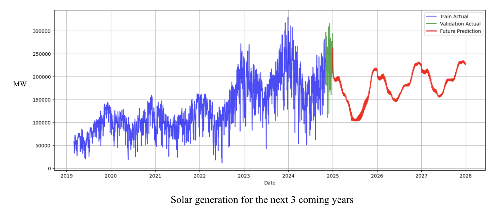

# ⚡ Assessing Renewable Energy Efficacy: A Queensland-based Analysis of Solar Generation and Electricity Prices Dynamics

This project investigates how **renewable energy integration** — especially **solar energy** — and **demand behavior** influence **electricity pricing** in Queensland, and predict solar energy generation and electricity prices using data from the **Australian National Electricity Market (AEMO)** between **January 2019 and January 2025**.

---

## 🎯 Research Questions

- Analysis research questions:

How has the share of renewable energy been increasing in Australia?
How does this growing solar energy penetration influence electricity pricing patterns and consumer demand behavior, particularly in Queensland?

- Modeling research questions:

How will solar energy and electricity prices evolve in coming years? How can they be modelled or projected?
What is the potential for applying Transformer model in this field of energy and price prediction?

---

## 🎯 Project Tasks

- Quantifying the **impact of solar generation and demand** on electricity prices.
- Exploring **seasonal**, **daily**, and **holiday patterns** in generation, demand and solar generation.
- Conduct **statistical models** to test insights.
- Building dashboard for relationship and trend analysis for Queensland.
- Building **forecasting models** to predict price and solar generation for Queensland.
- Evaluate and compare results by MAE, RMSE, etc and DM test.


---

## 🧱 Data Sources

- Data is from Australian Electricity Market (AEMO website) from Jan 2019 to Jan 2025.

| Dataset                     | Description                                                |
|-----------------------------|------------------------------------------------------------|
| `DISPATCH_UNIT_SCADA`       | Actual generation data at the unit level (every 5 mins).   |
| `PERDEMAND`                 | Regional demand data at 5-min intervals.                   |
| `DISPATCHPRICE`             | Electricity price data (regional and dispatch-level).      |
| `NEM Registration`          | Info on registered market participants and generating units. |

---

## 🗂️ Notebooks Overview

| Folder              | Purpose                                                                  |
| ------------------- | ------------------------------------------------------------------------ |
| `data_processing/`  | Preprocess and clean raw datasets; includes reusable utility functions.  |
| `data_analysis/`    | Analyze trends in energy generation, demand, and pricing.                |
| `data_modelling/`   | Build and train models to explain or predict electricity price/ solar.   |
| `models/`           | Store best models.                                                       |
| `model_deployment/` | Deploy model for production (simulation).                                |

---

## 🛠️ Tech Stack

- **Python**: `pandas`, `numpy`, `matplotlib`, `seaborn`, `plotly`, `sqlite3`, `holidays`, `statsmodels`, `scikit-learn`, `xgboost`, `keras`, `tensorflow`, `shap`
- **Data Source**: AEMO datasets (via CSV or SQLite)
- **Visualization**: Tableau & Plotly
- **Modeling**: , statistical models (ANOVA, ttest, DM test), time series models (Transformer, LSTM, GRU, LSTM-Attention, hybrid models, etc)

---

## Results

** One of the result images (univariate model - solar energy) **


For a detailed presentation, view it here: [Google Slides Presentation](https://docs.google.com/presentation/d/1hurSQVaKEYKYdTDAFGarVOM05Atarhr4pqEn6pKJ0BY/edit?usp=sharing)

---
## 📦 Setup

Install required Python packages:

```bash
pip install -r requirements.txt


